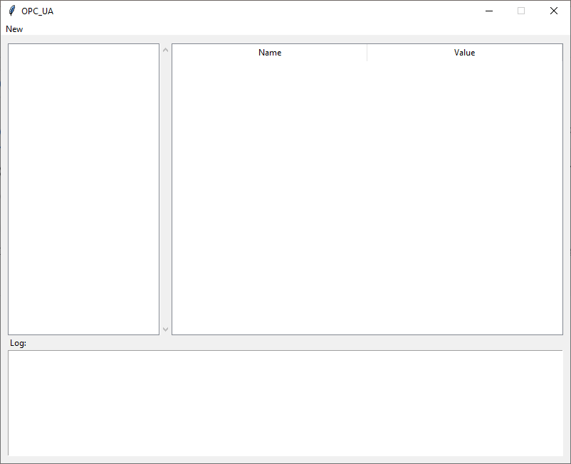
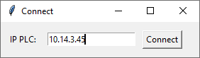
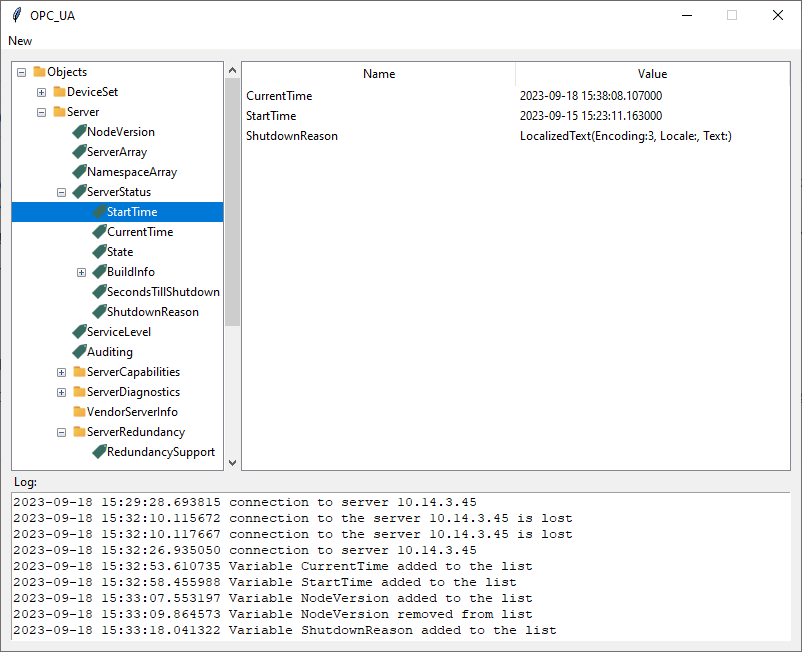

<h1> OPC UA Client</h1>

This application implements a simple OPC UA client for testing the functionality of the server. The client functionality includes the ability to establish a connection with the server without using passwords or encryption, receive data from the server and select variables for monitoring

<h2> How it works</h2>

After running the main.exe file, the main application window will open:

To connect to the server, you must click "menu New" -> "Connect",a new window will open in which you need to enter the IP address of the device and click on the “Connect” button

After a successful connection to the server, available server objects will appear in the tree window and a message about the successful connection will appear in the log window. In case of failure, a message about the reasons will also appear in the log.

In order to add a variable to the monitoring table, you need to right-click on it and select "add to list"
  In order to delete a variable from the monitoring table, you need to right-click on it in the table window and select "delete"

